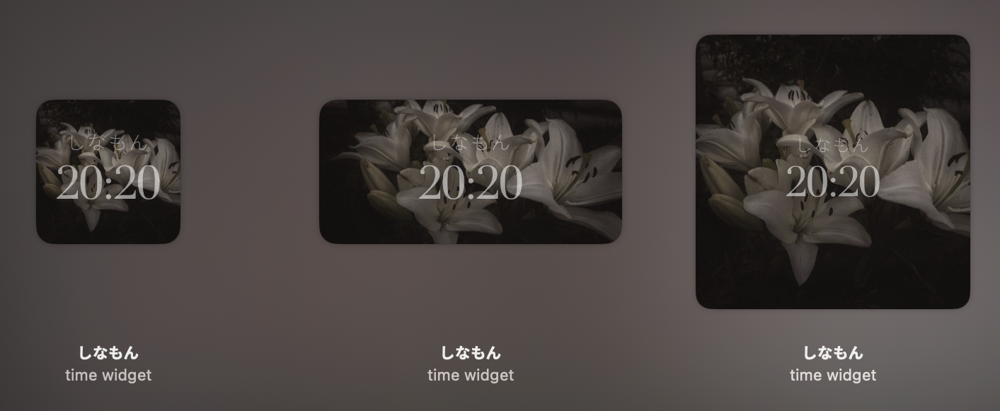

# しなもん

a small, quiet time widget for macOS

---

**stack** · Swift · SwiftUI · WidgetKit  
**font** · Didot  
**requires** · macOS 15.7+

---

## install
1. clone the repo
2. open `widget.xcodeproj` in Xcode
3. **Product → Archive → Custom → Copy App**
4. move `.app` to Applications and launch

---
